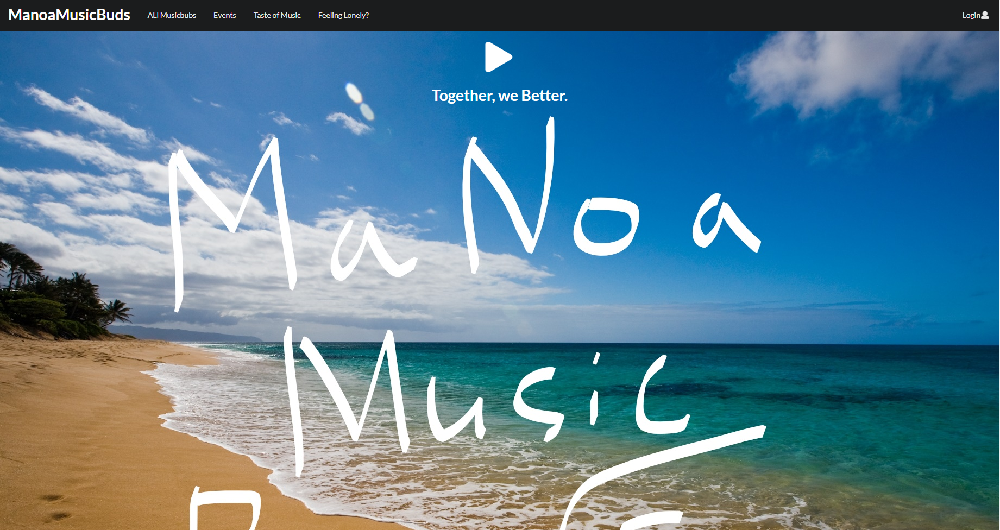
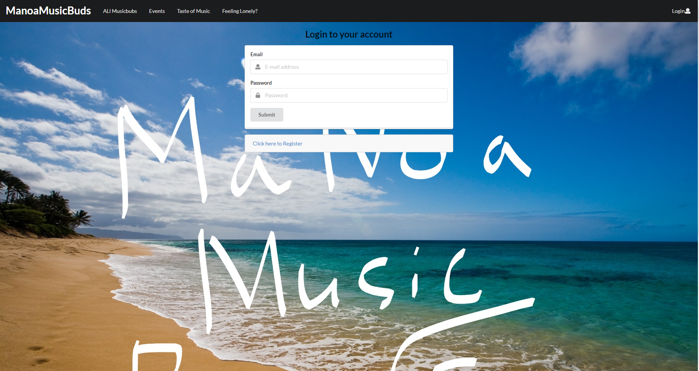
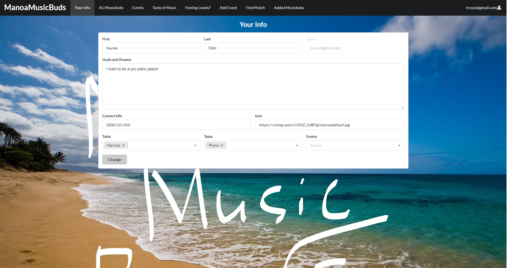
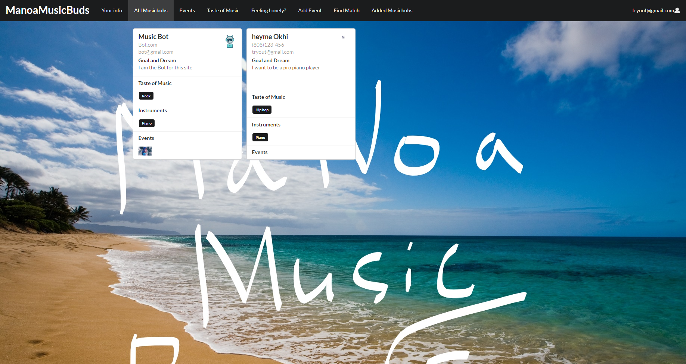
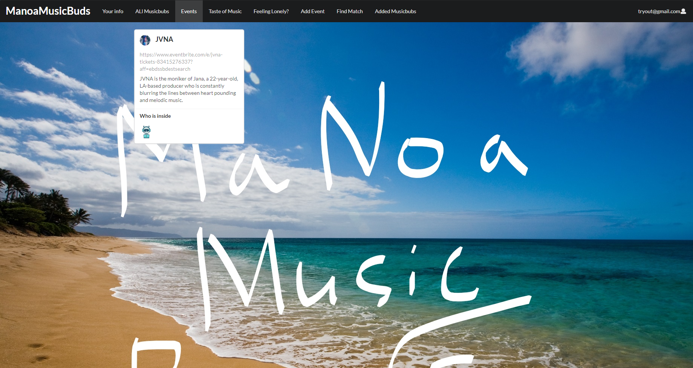
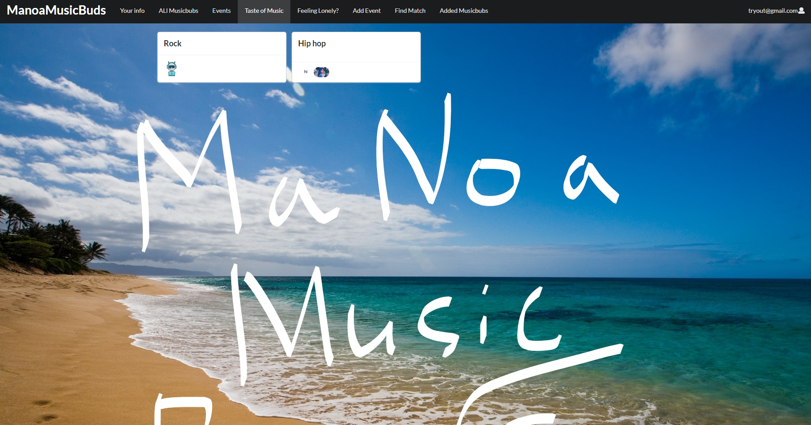
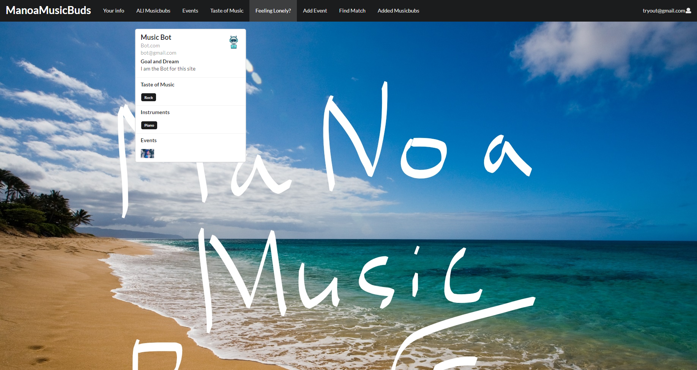
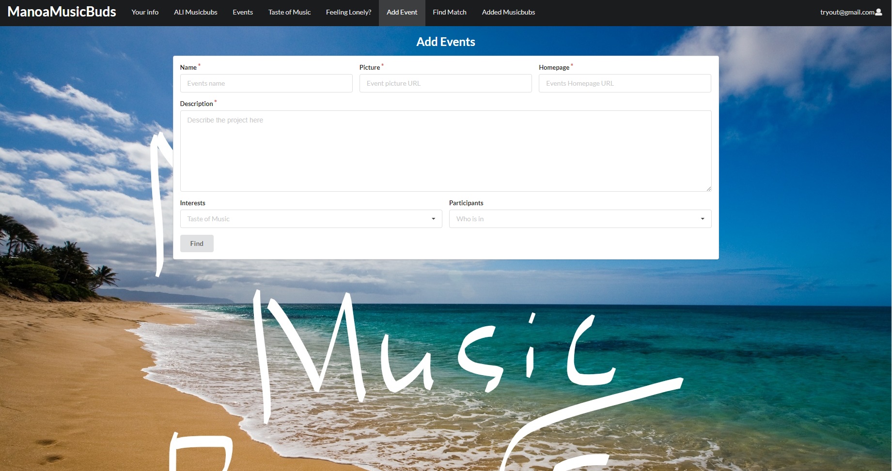
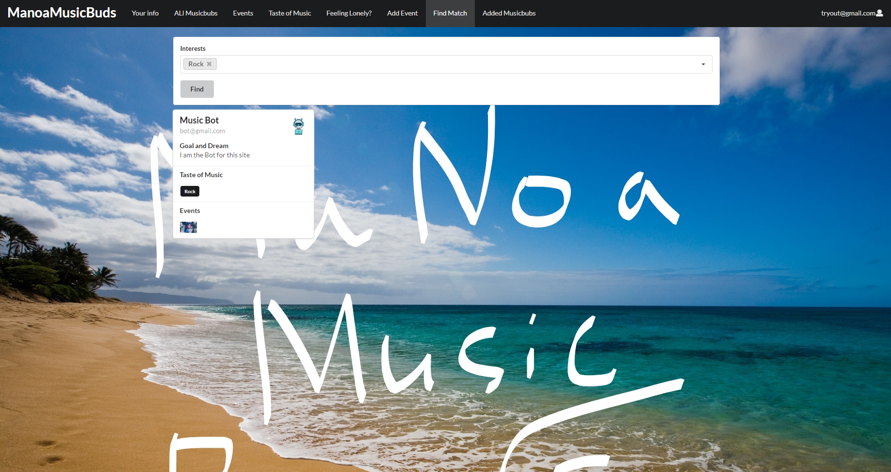
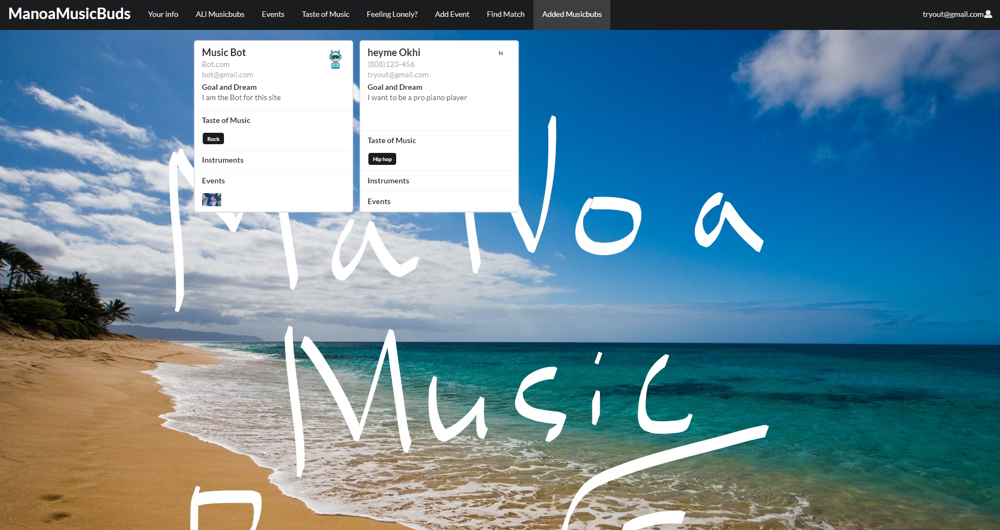

## Table of contents

* [Overview](#Overview)
* [Links](#links)
* [Goals](#goals)
* [Skills](#skills)
* [WalkThrough](#WalkThrough)
* [Community Feedback](#Community-feedback)
* [Development Guide](#development-Guide)
* [Team](#Team)

## Overview

manoa-musicbuds is an example web application where many UH students with great musical talents find others with similar tastes and compatible musical abilities. It will allow students to login and create a profile indicating their musical tastes, their musical capabilities, and their musical goals (from occasional, informal jam sessions to performing bands). The profile can also include links to YouTube videos or SoundCloud tracks with examples of their musicianship. 

## Site info
Site [Landing](http://musicbub.meteorapp.com/#/) : 

[Sign-Up Page](http://musicbub.meteorapp.com/#/signup) :

[Log-In Page](http://musicbub.meteorapp.com/#/signin) :

Your info Page: After user sign in, it will bring users to the your info page to enter info about them.

All Manoabubs Page: After user enter information, user can see all user that have sign up for the page including the user itself.
It show user name, email, contact, tastes of music, event invold, and dream and goal.

Event Page: Show all the events that is going on right now.
It show who is inside too.

Taste of Music Page: Show all the Taste of Music and show users icon under the taste it have.

FeelingLonley Page: Help user that just want to meet random friend, can click on it. It will random one music bubs.

Add Event Page: Allow users to add new event that is happening in the music world.

Find Match Page: Allow users to filter the taste of music to find the music bub that is perfect for them.

Added MusicBubs Page: Are the added musicbubs from the user.

It illustrates various technologies useful to ICS software engineering students, including:

* [Meteor](https://www.meteor.com/) for Javascript-based implementation of client and server code.
* [React](https://reactjs.org/) for component-based UI implementation and routing.
* [Semantic UI React](https://react.semantic-ui.com/) CSS Framework for UI design.
* [Uniforms](https://uniforms.tools/) for React and Semantic UI-based form design and display.

## Links

* [Manoa musicbubs Webpage](https://manoa-musicbubs.github.io/)
* [Manoa musicbubs Organization Page](https://github.com/manoa-musicbubs)
* [Milestone 1](https://github.com/manoa-musicbubs/manoa-musicbuds-source/projects/1)
* [Milestone 2](https://github.com/manoa-musicbubs/manoa-musicbuds-source/projects/3#column-8772765)
* [Milestone 3]

## goals:

* Doyoung Kim: improve my understanding of frond-end coding.
* David Badke: Issue Driven project Development.
* Yiwen Chen: Learn how to develop a website with a team
* Nelson Liang: Improve my coding and problem-solving skills.

## Skills:
* Doyoung Kim: Java, Java Script, Python.
* David Badke: Java Script, Java.
* Yiwen Chen: HTML, JavaScript, Semantic UI.
* Nelson Liang: Java Script, Java.

## Team

* [David Badke](https://github.com/davidrb) (Web Developer)
* [Doyoung Kim](https://github.com/doyounghi) (Web Developer)
* [Yiwen Chen](https://github.com/yiwenc22) (Web Developer)
* [Nelson Liang](https://github.com/Nelson-Liang) (Web Developer)
