## Table of contents

* [Overview](#Overview)
* [Site Info](#site-info)
* [Installation](#Installation)
* [Running the system](#Running-the-system)
* [Links](#links)
* [Goals](#goals)
* [Skills](#skills)
* [WalkThrough](#WalkThrough)
* [Community Feedback](#Community-feedback)
* [Development Guide](#development-Guide)
* [Team](#Team)


## Overview

manoa-musicbuds is an example web application where many UH students with great musical talents find others with similar tastes and compatible musical abilities. It will allow students to login and create a profile indicating their musical tastes, their musical capabilities, and their musical goals (from occasional, informal jam sessions to performing bands). The profile can also include links to YouTube videos or SoundCloud tracks with examples of their musicianship. 

## Site Info
Site [Landing](http://musicbuds.meteorapp.com/#/) : Can see the brief overall of the Site.
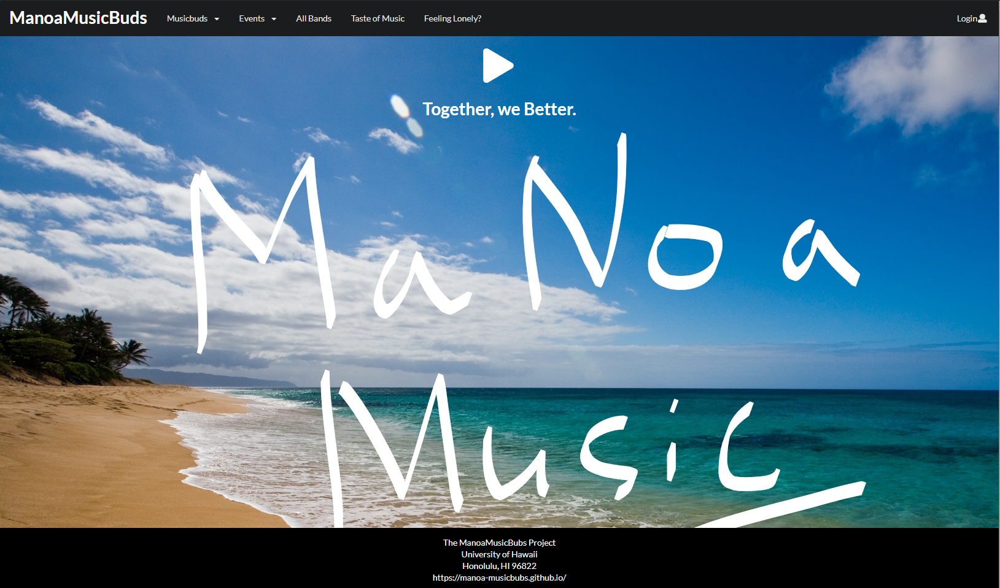

[Sign-Up Page](http://musicbuds.meteorapp.com/#/signup) : Users can sign up with email and a password.


[Log-In Page](http://musicbuds.meteorapp.com/#/signin) : 
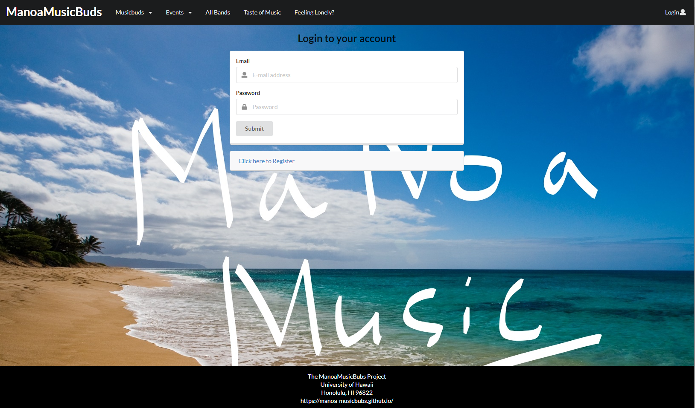

Your info Page: After user sign in, it will bring users to your info page to enter info about them.


All Manoabubs Page: After user enter information, user can see all other users that have sign up for the site including the user itself.
It shows user name, email, contact, tastes of music, instrument, event, and dream and goal.
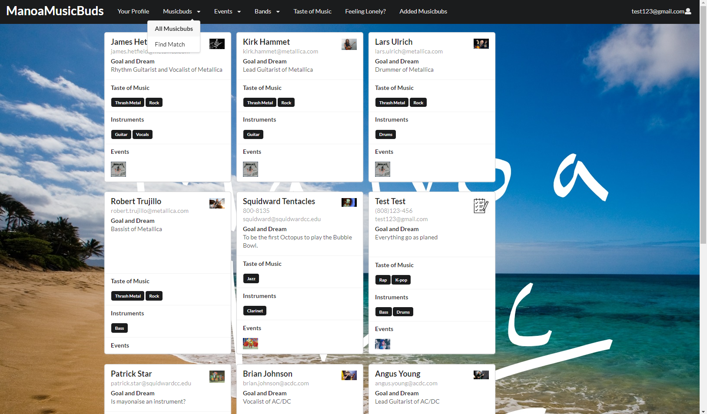

Find Match Page: Allow user to filter though taste of music or instrument others users have. So the users can find the perfect musicbuds.
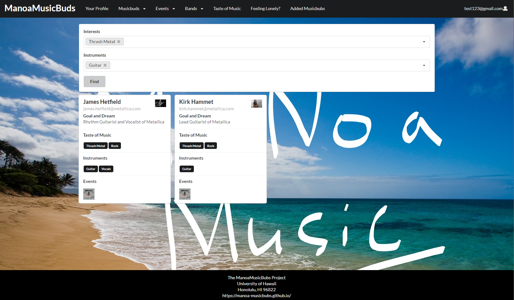

Events Page : Shows events of music that is upload by other users or the admin.
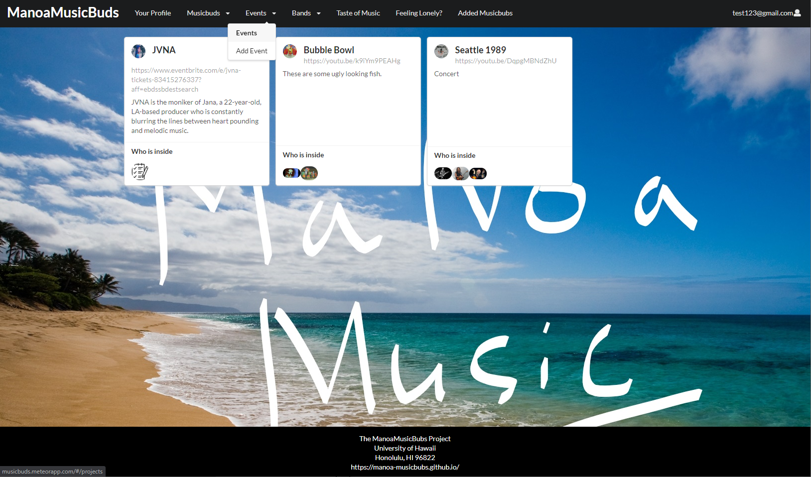

Add Events Page : Allow users to add events, that users is involved in or want to share.


All Band Page : Show bands that is upload by other users or the admin. Allow users to apply for position of the band.
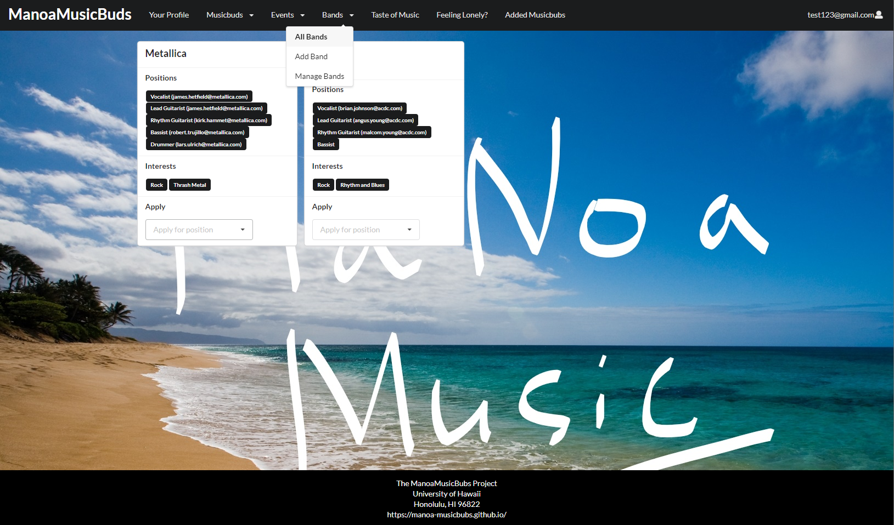
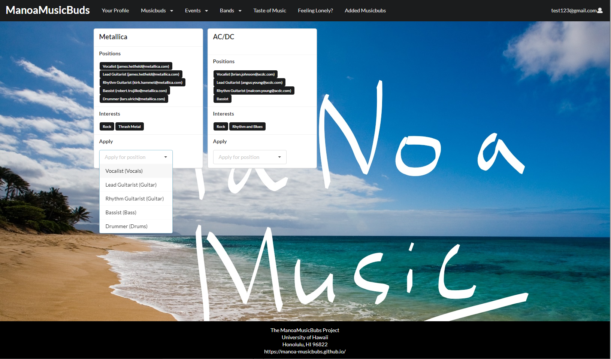

Add Band Page : Allow users to add brands, that users is involved or want to share.
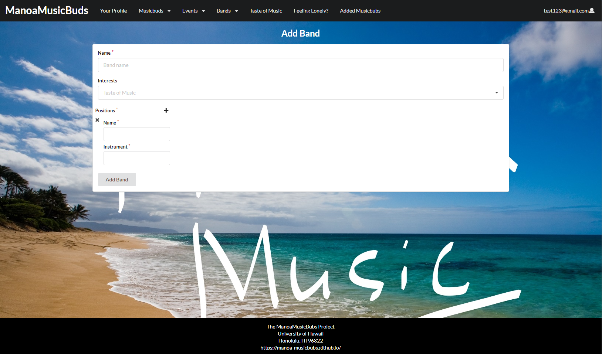

Taste of Music Page : Show the taste of music the site have and what users have the same tastes with others.
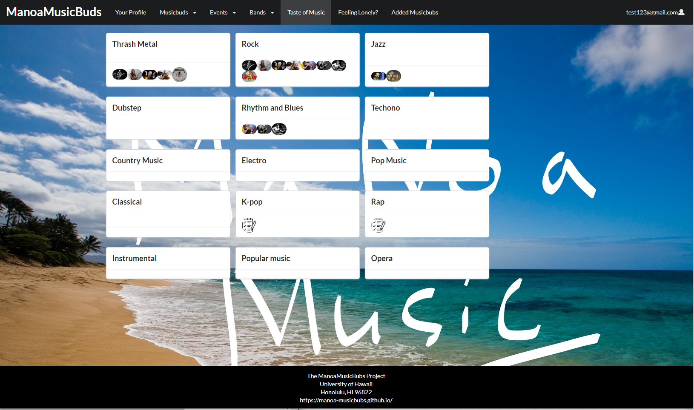

FeelingLonely Page : Help user that just want to meet random friend, can click on it. It will random one music bubs.
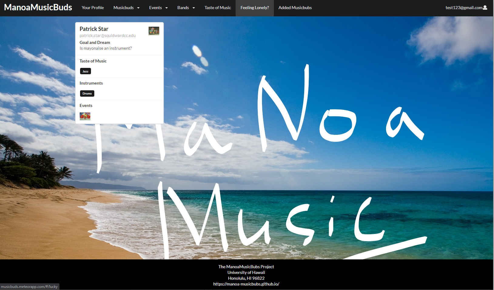

Added MusicBubs Page: Shows the musicbuds that the users added.
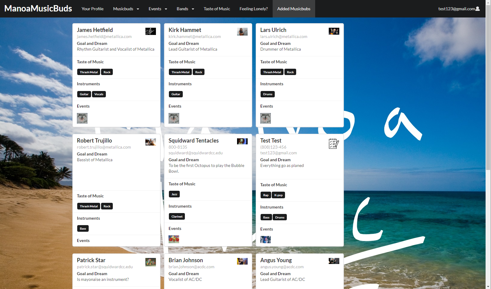

It illustrates various technologies useful to ICS software engineering students, including:

* [Meteor](https://www.meteor.com/) for Javascript-based implementation of client and server code.
* [React](https://reactjs.org/) for component-based UI implementation and routing.
* [Semantic UI React](https://react.semantic-ui.com/) CSS Framework for UI design.
* [Uniforms](https://uniforms.tools/) for React and Semantic UI-based form design and display.

## Installation

First, [install Meteor](https://www.meteor.com/install).

Second, go to [https://github.com/manoa-musicbubs/manoa-musicbuds-source](https://github.com/manoa-musicbubs/manoa-musicbuds-source), and click the "Use this template" button. Complete the dialog box to create a new repository that you own that is initialized with this template's files.

Third, go to your newly created repository, and click the "Clone or download" button to download your new GitHub repo to your local file system.  Using [GitHub Desktop](https://desktop.github.com/) is a great choice if you use MacOS or Windows.

Fourth, cd into the app/ directory of your local copy of the repo, and install third party libraries with:

```
$ meteor npm install
```

## Running the system

Once the libraries are installed, you can run the application by invoking the "start" script in the [package.json file](https://github.com/manoa-musicbubs/manoa-musicbuds-source/blob/master/app/package.json):

```
$ meteor npm run start
```

The first time you run the app, it will create some default users and data. Here is the output:

```
> manoamusicbubs@ start C:\Users\Name\Documents\GitHub\manoa-musicbuds-source\app
> meteor --no-release-check --settings ../config/settings.development.json

[[[[[ C:\Users\Name\Documents\GitHub\manoa-musicbuds-source\app ]]]]]

=> Started proxy.
=> Started MongoDB.
W20200428-11:00:18.056(-10)? (STDERR) Note: you are using a pure-JavaScript implementation of bcrypt.
W20200428-11:00:18.144(-10)? (STDERR) While this implementation will work correctly, it is known to be
W20200428-11:00:18.145(-10)? (STDERR) approximately three times slower than the native implementation.
W20200428-11:00:18.145(-10)? (STDERR) In order to use the native implementation instead, run
W20200428-11:00:18.146(-10)? (STDERR)
W20200428-11:00:18.146(-10)? (STDERR)   meteor npm install --save bcrypt
W20200428-11:00:18.146(-10)? (STDERR)
W20200428-11:00:18.147(-10)? (STDERR) in the root directory of your application.
I20200428-11:00:19.286(-10)? Creating the default profiles
I20200428-11:00:19.286(-10)? Defining profile bot@gmail.com
I20200428-11:00:19.981(-10)? Creating the default projects
I20200428-11:00:19.981(-10)? Defining project JVNA
=> Started your app.

=> App running at: http://localhost:3000/
   Type Control-C twice to stop.
```
Check to see that it’s running at http://localhost:3000(http://localhost:3000). Take a look at the console to be sure there are no errors.

##Note regarding "bcrypt warning":##

You will also get the following message when you run this application:

```
Note: you are using a pure-JavaScript implementation of bcrypt.
While this implementation will work correctly, it is known to be
approximately three times slower than the native implementation.
In order to use the native implementation instead, run

  meteor npm install --save bcrypt

in the root directory of your application.
```

On some operating systems (particularly Windows), installing bcrypt is much more difficult than implied by the above message. Bcrypt is only used in Meteor for password checking, so the performance implications are negligible until your site has very high traffic. You can safely ignore this warning without any problems during initial stages of development.

##Reset##

To clear the database from changes made on the application, run:

```
$ meteor reset
```

##ESLint##

You can verify that the code obeys our coding standards by running ESLint over the code in the imports/ directory with:

```
meteor npm run lint
```

## Links

* [Manoa musicbubs Webpage](https://manoa-musicbubs.github.io/)
* [Manoa musicbubs Organization Page](https://github.com/manoa-musicbubs)
* [Milestone 1](https://github.com/manoa-musicbubs/manoa-musicbuds-source/projects/1)
* [Milestone 2](https://github.com/manoa-musicbubs/manoa-musicbuds-source/projects/3#column-8772765)
* [Milestone 3](https://github.com/manoa-musicbubs/manoa-musicbuds-source/projects/4)

## goals:

* Doyoung Kim: improve my understanding of frond-end coding.
* David Badke: Issue Driven project Development.
* Yiwen Chen: Learn how to develop a website with a team
* Nelson Liang: Improve my coding and problem-solving skills.

## Skills:
* Doyoung Kim: Java, Java Script, Python.
* David Badke: Java Script, Java.
* Yiwen Chen: HTML, JavaScript, Semantic UI.
* Nelson Liang: Java Script, Java.


## Team

* [David Badke](https://github.com/davidrb) (Web Developer)
* [Doyoung Kim](https://github.com/doyounghi) (Web Developer)
* [Yiwen Chen](https://github.com/yiwenc22) (Web Developer)
* [Nelson Liang](https://github.com/Nelson-Liang) (Web Developer)
