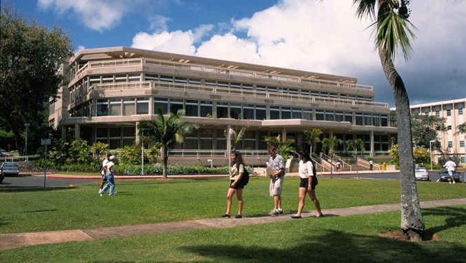

## Table of contents

* [Overview](#Overview)
* [Links](#links)
* [WalkThrough](#WalkThrough)
* [Community Feedback](#Community-feedback)
* [Development Guide](#development-Guide)
* [Team](#Team)

## Overview

manoa-musicbuds is an example web application where many UH students with great musical talents find others with similar tastes and compatible musical abilities. It will allow students to login and create a profile indicating their musical tastes, their musical capabilities, and their musical goals (from occasional, informal jam sessions to performing bands). The profile can also include links to YouTube videos or SoundCloud tracks with examples of their musicianship. 

It illustrates various technologies useful to ICS software engineering students, including:

* [Meteor](https://www.meteor.com/) for Javascript-based implementation of client and server code.
* [React](https://reactjs.org/) for component-based UI implementation and routing.
* [Semantic UI React](https://react.semantic-ui.com/) CSS Framework for UI design.
* [Uniforms](https://uniforms.tools/) for React and Semantic UI-based form design and display.

## Links

* [Manoa musicbubs Webpage](https://manoa-musicbubs.github.io/)
* [Manoa musicbubs Organization Page](https://github.com/manoa-musicbubs)
* [Milestone 1](https://github.com/orgs/manoa-musicbubs/projects/3?add_cards_query=is%3Aopen)
* [Milestone 2]
* [Milestone 3]

## Team

* [David Badke](https://github.com/davidrb) (Web Developer)
* [Doyoung Kim](https://github.com/doyounghi) (Web Developer)
* [Yiwen Chen](https://github.com/yiwenc22) (Web Developer)
* [Nelson Liang](https://github.com/Nelson-Liang) (Web Developer)
