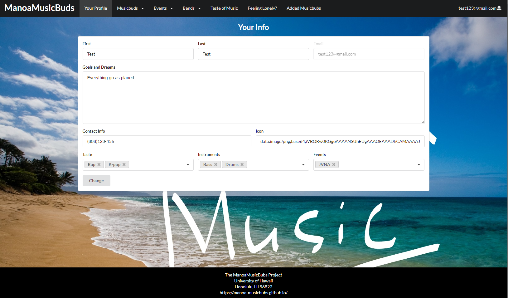

## Table of contents

* [Overview](#Overview)
* [Site Info](#site-info)
* [Links](#links)
* [Goals](#goals)
* [Skills](#skills)
* [WalkThrough](#WalkThrough)
* [Community Feedback](#Community-feedback)
* [Development Guide](#development-Guide)
* [Team](#Team)

## Overview

manoa-musicbuds is an example web application where many UH students with great musical talents find others with similar tastes and compatible musical abilities. It will allow students to login and create a profile indicating their musical tastes, their musical capabilities, and their musical goals (from occasional, informal jam sessions to performing bands). The profile can also include links to YouTube videos or SoundCloud tracks with examples of their musicianship. 

## Site Info
Site [Landing](http://musicbuds.meteorapp.com/#/) : Can see the brief overall of the Site.

[Sign-Up Page](http://musicbuds.meteorapp.com/#/signup) : Users can sign up with email and a password.

[Log-In Page](http://musicbuds.meteorapp.com/#/signin) : 

Your info Page: After user sign in, it will bring users to your info page to enter info about them.

All Manoabubs Page: After user enter information, user can see all other users that have sign up for the site including the user itself.
It shows user name, email, contact, tastes of music, instrument, event, and dream and goal.

Find Match Page: Allow user to filter though taste of music or instrument others users have. So the users can find the perfect musicbuds.

Events Page : Shows events of music that is upload by other users or the admin.

Add Events Page : Allow users to add events, that users is involved in or want to share.

All Band Page : Show bands that is upload by other users or the admin. Allow users to apply for position of the band.

Add Band Page : Allow users to add brands, that users is involved or want to share.

Taste of Music Page : Show the taste of music the site have and what users have the same tastes with others.

FeelingLonely Page : Help user that just want to meet random friend, can click on it. It will random one music bubs.

Added MusicBubs Page: Shows the musicbuds that the users added.

It illustrates various technologies useful to ICS software engineering students, including:

* [Meteor](https://www.meteor.com/) for Javascript-based implementation of client and server code.
* [React](https://reactjs.org/) for component-based UI implementation and routing.
* [Semantic UI React](https://react.semantic-ui.com/) CSS Framework for UI design.
* [Uniforms](https://uniforms.tools/) for React and Semantic UI-based form design and display.

## Links

* [Manoa musicbubs Webpage](https://manoa-musicbubs.github.io/)
* [Manoa musicbubs Organization Page](https://github.com/manoa-musicbubs)
* [Milestone 1](https://github.com/manoa-musicbubs/manoa-musicbuds-source/projects/1)
* [Milestone 2](https://github.com/manoa-musicbubs/manoa-musicbuds-source/projects/3#column-8772765)
* [Milestone 3](https://github.com/manoa-musicbubs/manoa-musicbuds-source/projects/4)

## goals:

* Doyoung Kim: improve my understanding of frond-end coding.
* David Badke: Issue Driven project Development.
* Yiwen Chen: Learn how to develop a website with a team
* Nelson Liang: Improve my coding and problem-solving skills.

## Skills:
* Doyoung Kim: Java, Java Script, Python.
* David Badke: Java Script, Java.
* Yiwen Chen: HTML, JavaScript, Semantic UI.
* Nelson Liang: Java Script, Java.

## Team

* [David Badke](https://github.com/davidrb) (Web Developer)
* [Doyoung Kim](https://github.com/doyounghi) (Web Developer)
* [Yiwen Chen](https://github.com/yiwenc22) (Web Developer)
* [Nelson Liang](https://github.com/Nelson-Liang) (Web Developer)
